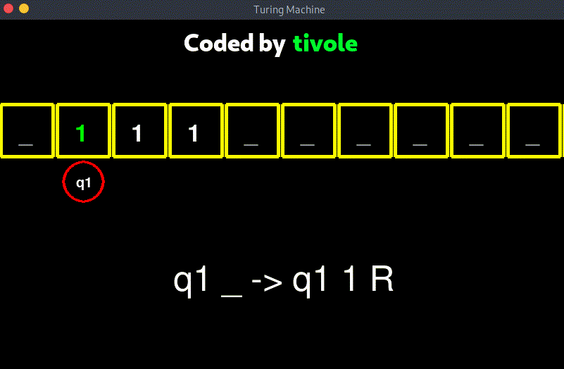

# Double Ones

## Turing Machine for Double Ones problem

### Code:

```
# turing_code.txt

ALPHABET = {1, _, *, $};
EMPTY = {_};
START_STATE = {q1};
STOP_STATE = {q0};

q1,1 -> q1,1,R;
q1,_ -> q3,*,L;

q3,* -> q3,*,L;
q3,$ -> q4,$,R;
q3,1 -> q3,1,L;
q3,_ -> q4,_,R;

q4,1 -> q5,$,R;
q4,* -> q6,1,L;

q5,* -> q5,*,R;
q5,1 -> q5,1,R;
q5,_ -> q3,1,L;

q6,$ -> q6,1,L;
q6,_ -> q6,_,R;
q6,1 -> q7,_,R;

q7,1 -> q0,1,S;
```

### Visualisation:

<p align="center">
  
</p>


## More Examples:

1. [Bracket Sequence](../Bracket%20Sequence/README.md)
2. [Right Shift](../Right%20Shift/README.md)