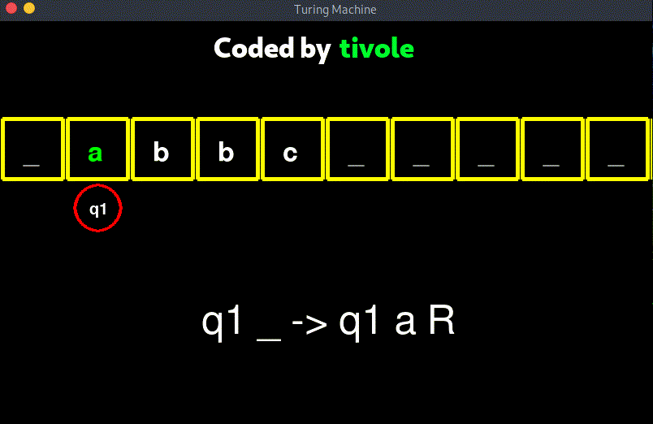

# Right Shift

## Turing Machine for Right Shift problem

### Code:

```
# turing_code.txt

ALPHABET = {_, a, b, c};
EMPTY = {_};
START_STATE = {q1};
STOP_STATE = {q0};

q1,a -> q1,a,R;
q1,b -> q1,b,R;
q1,c -> q1,c,R;
q1,_ -> q2,_,L;

q2,a -> q4,_,R;
q4,_ -> q3,a,L;

q2,b -> q5,_,R;
q5,_ -> q3,b,L;

q2,c -> q6,_,R;
q6,_ -> q3,c,L;

q3,_ -> q2,_,L;
q2,_ -> q7,_,R;

q7,_ -> q7,_,R;
q7,a -> q0,a,S;
q7,b -> q0,b,S;
q7,c -> q0,c,S;
```

### Visualisation:

<p align="center">
  
</p>


## More Examples:

1. [Bracket Sequence](../Bracket%20Sequence/README.md)
2. [Double Ones](../Double%20Ones/README.md)